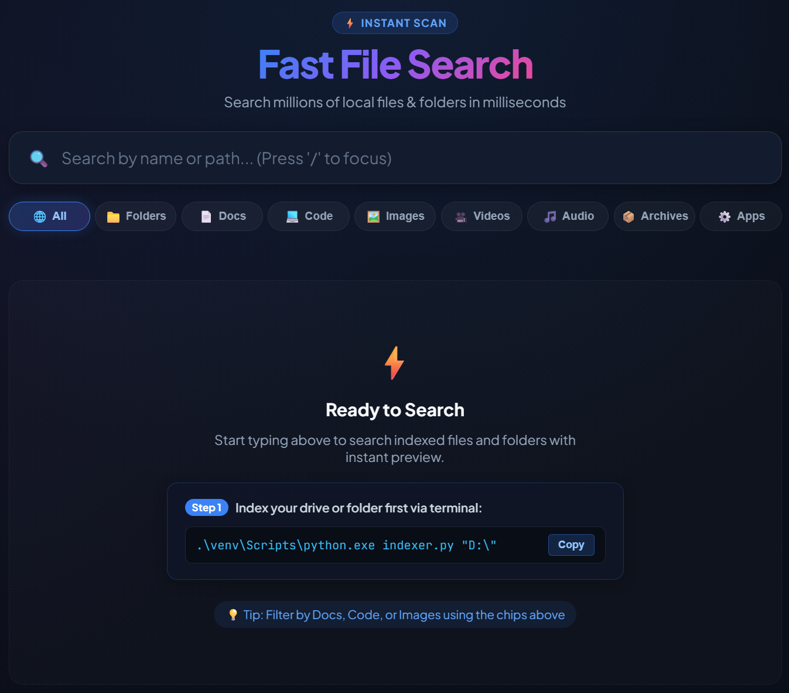

# Fast File Scanner & Search Tool

A high-performance local file indexing and instant search application with a modern web UI and native Windows desktop integration.



## 📖 Usage

> **Important:** Always navigate to the `fast_search` folder before running scripts

### 1. Indexing a Directory

Run `indexer.py` and pass the path of the directory or drive you want to index:

*Example:*
```powershell
.\venv\Scripts\python.exe indexer.py "C:\Backup2026\"
```

> **Note:** Indexing handles nested directories recursively, skips folders with restricted permissions gracefully, and updates the SQLite database without duplicates.

---

### 2. Starting the Search Server

Start the FastAPI application:

```powershell
cd d:\_fast_search
.\venv\Scripts\python.exe app.py
```

The server will start locally at **[http://127.0.0.1:8000](http://127.0.0.1:8000)**.

---

### 3. Searching Files

1. Open your browser and go to: **[http://127.0.0.1:8000](http://127.0.0.1:8000)**
2. Start typing in the search bar. Results appear dynamically (limited to top 100 matches).
3. **Click on any file or folder** to immediately launch/open it on your Windows desktop.

---

---

## 🚀 Overview

Fast File Scanner is built to index directories rapidly and provide instant real-time file lookups through a clean, responsive dark-mode web interface. Clicking on any file or folder in the search results directly opens it in Windows Explorer or its default application.

### Key Features

- **⚡ Blazing Fast Directory Traversal**: Utilizes Python's `os.scandir()` with recursive batch insertion (10,000 items/batch) in SQLite WAL mode.
- **🚫 Smart Ignore Filters**: Automatically skips junk and bloated directories during indexing: Python cache (`__pycache__`, `.pytest_cache`), virtualenvs (`venv`, `.venv`), `node_modules`, version control (`.git`, `.svn`), build folders (`dist`, `build`), and system files (`$RECYCLE.BIN`, `thumbs.db`).
- **📁 Folder-First Results**: Search queries prioritize directories at the top with distinct amber styling and `FOLDER` badges.
- **🏷️ File Type Filter Bar**: Instant filtering chips for **Folders**, **Docs**, **Code**, **Images**, **Videos**, **Audio**, **Archives**, and **Apps**.
- **🔍 Instant Database Search**: Backed by SQLite (`index.db`) in WAL mode with case-insensitive queries and query term highlighting.
- **🎨 Sleek Dark-Themed Web UI**: Responsive glassmorphic layout, micro-animations, keyboard shortcuts (`/` to focus), and toast notifications.
- **🖥️ Native Desktop Integration**: Uses Windows `os.startfile()` via `/api/open` to open files or reveal directories on your desktop with a single click.
- **⚙️ Lightweight FastAPI Backend**: Multi-threaded SQLite connections with 30s busy timeouts and resilient retry handlers.

---

## 📁 Project Structure

```text
fast_search/
├── app.py              # FastAPI server hosting the REST API and serving UI
├── db.py               # SQLite schema definition, indexes, and search queries
├── indexer.py          # Directory traversal and batch indexing engine
├── requirements.txt    # Python package dependencies
├── index.db            # Generated SQLite database file
├── static/             # Frontend assets
│   ├── index.html      # Search interface with debounce logic and API hooks
│   └── styles.css      # Dark-mode styling, smooth animations, and layout
└── venv/               # Python virtual environment
```

---

## 🛠️ Installation & Setup

### Prerequisites

- **Python 3.10+** (Windows)

### 1. Set Up Virtual Environment

Open PowerShell or Command Prompt in this folder:

```powershell
cd c:\Backup2026\Dev\test\fast_search
python -m venv venv
.\venv\Scripts\activate
```

### 2. Install Dependencies

```powershell
pip install -r requirements.txt
```

*(Dependencies: `fastapi`, `uvicorn`, `pydantic`)*

---

## 🔌 API Endpoints

| Method | Endpoint | Description | Request / Payload |
|---|---|---|---|
| `GET` | `/` | Serves the search frontend (`index.html`) | None |
| `GET` | `/api/search` | Performs wildcard query on filename & filepath | `?q=<search_term>` |
| `POST` | `/api/open` | Launches the file/folder via native Windows OS | `{"filepath": "C:\\path\\to\\file"}` |

---

## ⚙️ Technical Details & Architecture

- **Database Engine (`db.py`)**: Uses standard SQLite with connection settings allowing multi-threaded FastAPI access (`check_same_thread=False`). `files` table schema stores `(id, filename, filepath, is_directory)` with a dedicated `idx_filename` index.
- **Batch Processing (`indexer.py`)**: Gathers directory entries in batches of `10,000` before executing `executemany` with `INSERT OR IGNORE` to maximize I/O throughput.
- **Desktop Interop (`app.py`)**: Implements `os.startfile()` on Windows, allowing execution of any registered file type or folder without blocking the web event loop.
